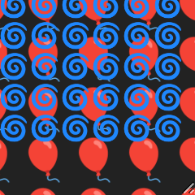

<h1>
super-impose <a href="https://npmjs.org/package/super-impose"></a> <a href="src"></a> <a href="https://cdn.jsdelivr.net/npm/super-impose@4.0.0/dist/super-impose.min.js"></a> <a href="LICENSE"></a>
</h1>

<p></p>

Web Component that super imposes one child over another to the same scroll position

<h4>
<table><tr><td title="Triple click to select and copy paste">
<code>npm i super-impose </code>
</td><td title="Triple click to select and copy paste">
<code>pnpm add super-impose </code>
</td><td title="Triple click to select and copy paste">
<code>yarn add super-impose</code>
</td></tr></table>
</h4>

## Examples

<details id="example$complex" title="complex" open><summary><span><a href="#example$complex">#</a></span>  <code><strong>complex</strong></code></summary>  <ul>  <p><a href="https://stagas.github.io/super-impose/example/complex.html"><strong>Try it live</strong></a></p>  <details id="source$complex" title="complex source code" ><summary><span><a href="#source$complex">#</a></span>  <code><strong>view source</strong></code></summary>  <a href="example/complex.ts">example/complex.ts</a>  <p>

```ts
import { SuperImposeElement } from 'super-impose'

customElements.define('super-impose', SuperImposeElement)

class WrapElement extends HTMLElement {
  constructor() {
    super()
    this.attachShadow({ mode: 'open' })
    this.shadowRoot!.innerHTML = /*html*/ `
      <style>
        :host {
          display: flex;
          position: relative;
          resize: both;
          white-space: pre;
          overflow: scroll;
        }
        [part="box"] {
        }
      </style>

      <super-impose part="box">
        <textarea slot="leader" part="leader" wrap="off">
          some content wide enough to scroll<br />
          some content wide enough to scroll<br />
          some content wide enough to scroll<br />
          some content wide enough to scroll<br />
          some content wide enough to scroll<br />
          some content wide enough to scroll<br />
          some content wide enough to scroll<br />
          some content wide enough to scroll<br />
          some content wide enough to scroll<br />
          some content wide enough to scroll<br />
          some content wide enough to scroll<br />
          some content wide enough to scroll<br />
          some content wide enough to scroll<br />
          some content wide enough to scroll<br />
          some content wide enough to scroll<br />
          some content wide enough to scroll<br />
        </textarea>
        <div slot="follower">
          other content<br />
          other content<br />
          other content<br />
          other content<br />
          other content<br />
          other content<br />
        </div>
      </super-impose>
    `
  }
}

customElements.define('wrap-element', WrapElement)

document.body.innerHTML = /*html*/ `
<style>
  * {
    background: transparent;
    color: #bbb;
  }
  wrap-element {
    width: 100px;
    height: 100px;
  }
</style>

<pre>
    one
    two
    three
    </pre>
    <div style="padding: 20px; border: 1px solid #000; width: 100px; height: 100px; overflow: hidden; resize: both">
      <super-impose onscroll="console.log(this.scrollTop, this.scrollLeft)">
        <textarea slot="leader" wrap="off">
some content wide enough to scroll
some content wide enough to scroll
some content wide enough to scroll
some content wide enough to scroll
some content wide enough to scroll
some content wide enough to scroll
some content wide enough to scroll
some content wide enough to scroll
some content wide enough to scroll
some content wide enough to scroll
some content wide enough to scroll
some content wide enough to scroll
some content wide enough to scroll
some content wide enough to scroll
some content wide enough to scroll
some content wide enough to scroll
        </textarea>
        <pre slot="follower" style="white-space: pre">
other content
other content
other content
other content
other content
other content
other content
        </pre>
      </super-impose>
    </div>
    <wrap-element></wrap-element>
`

const el = document.body.querySelector('super-impose')!
setTimeout(() => {
  el.remove()
  setTimeout(() => {
    document.body.appendChild(el)
  }, 500)
}, 2500)
```

</p>
</details></ul></details><details id="example$web" title="web" open><summary><span><a href="#example$web">#</a></span>  <code><strong>web</strong></code></summary>  <ul><p></p>  <a href="https://stagas.github.io/super-impose/example/web.html"></img>  <p><strong>Try it live</strong></p></a>    <details id="source$web" title="web source code" ><summary><span><a href="#source$web">#</a></span>  <code><strong>view source</strong></code></summary>  <a href="example/web.ts">example/web.ts</a>  <p>

```ts
import { SuperImposeElement } from 'super-impose'

customElements.define('super-impose', SuperImposeElement)

document.body.innerHTML = /*html*/ `
<super-impose
  id="demo"
  style="width: 120px; height: 120px; overflow: hidden; resize: both">
<pre slot="leader" style="color: #fa4; font-size: 25px;">
🎈🎈🎈🎈🎈🎈🎈🎈🎈
🎈🎈🎈🎈🎈🎈🎈🎈🎈
🎈🎈🎈🎈🎈🎈🎈🎈🎈
🎈🎈🎈🎈🎈🎈🎈🎈🎈
🎈🎈🎈🎈🎈🎈🎈🎈🎈
🎈🎈🎈🎈🎈🎈🎈🎈🎈
🎈🎈🎈🎈🎈🎈🎈🎈🎈
🎈🎈🎈🎈🎈🎈🎈🎈🎈
🎈🎈🎈🎈🎈🎈🎈🎈🎈
</pre>
<pre slot="follower" style="white-space: pre; color:#1ff; font-size: 15px;">
🌀🌀🌀🌀🌀🌀🌀
🌀🌀🌀🌀🌀🌀🌀
🌀🌀🌀🌀🌀🌀🌀
🌀🌀🌀🌀🌀🌀🌀
🌀🌀🌀🌀🌀🌀🌀
🌀🌀🌀🌀🌀🌀🌀
</pre>
</super-impose>
</div>
`

const leader = document.querySelector('[slot=leader]')!
const mag = 20
let i = 0
const render = () => {
  requestAnimationFrame(render)
  const x = (i * (1 / 1000)) * Math.PI * 2
  Object.assign(leader, {
    scrollLeft: mag + Math.sin(x) * mag,
    scrollTop: mag + Math.cos(x) * mag,
  })
  i += 1000 / 60
}
requestAnimationFrame(render)
```

</p>
</details></ul></details>

## API

<p>  <details id="SuperImposeElement$1" title="Class" open><summary><span><a href="#SuperImposeElement$1">#</a></span>  <code><strong>SuperImposeElement</strong></code>     &ndash; Super imposes one child (<code>follower</code>) contents over another
at the same scroll position determined by the <code>leader</code>.</summary>  <a href="src/index.ts#L70">src/index.ts#L70</a>  <ul>  <p>

```js
import { SuperImposeElement } from 'super-impose'
customElements.define('super-impose', SuperImposeElement)
```

--

```html
<super-impose>
  <div slot="leader"></div>
  <div slot="follower"></div>
</super-impose>
```

</p>
      <p>  <details id="constructor$2" title="Constructor" ><summary><span><a href="#constructor$2">#</a></span>  <code><strong>constructor</strong></code><em>()</em>    </summary>    <ul>    <p>  <details id="new SuperImposeElement$3" title="ConstructorSignature" ><summary><span><a href="#new SuperImposeElement$3">#</a></span>  <code><strong>new SuperImposeElement</strong></code><em>()</em>    </summary>    <ul><p><a href="#SuperImposeElement$1">SuperImposeElement</a></p>        </ul></details></p>    </ul></details><details id="$$54" title="Property" ><summary><span><a href="#$$54">#</a></span>  <code><strong>$</strong></code>    </summary>  <a href="src/work/stagas/sigl/dist/types/sigl.d.ts#L25">src/work/stagas/sigl/dist/types/sigl.d.ts#L25</a>  <ul><p><span>Context</span>&lt;<a href="#SuperImposeElement$1">SuperImposeElement</a> &amp; <span>JsxContext</span>&lt;<a href="#SuperImposeElement$1">SuperImposeElement</a>&gt; &amp; <span>Omit</span>&lt;{<p>    <details id="ctor$58" title="Parameter" ><summary><span><a href="#ctor$58">#</a></span>  <code><strong>ctor</strong></code>    </summary>    <ul><p><span>Class</span>&lt;<a href="#T$18">T</a>&gt;</p>        </ul></details>  <p><strong></strong>&lt;<span>T</span>&gt;<em>(ctor)</em>  &nbsp;=&gt;  <ul><span>CleanClass</span>&lt;<a href="#T$18">T</a>&gt;</ul></p>  <details id="ctx$73" title="Parameter" ><summary><span><a href="#ctx$73">#</a></span>  <code><strong>ctx</strong></code>    </summary>    <ul><p><a href="#T$33">T</a> | <span>Class</span>&lt;<a href="#T$33">T</a>&gt;</p>        </ul></details>  <p><strong></strong>&lt;<span>T</span>&gt;<em>(ctx)</em>  &nbsp;=&gt;  <ul><span>Wrapper</span>&lt;<a href="#T$33">T</a>&gt;</ul></p></p>} &amp; <span>__module</span> &amp; {<p>  <details id="Boolean$77" title="Property" ><summary><span><a href="#Boolean$77">#</a></span>  <code><strong>Boolean</strong></code>    </summary>  <a href="src/work/stagas/sigl/dist/types/index.d.ts#L9">src/work/stagas/sigl/dist/types/index.d.ts#L9</a>  <ul><p>undefined | boolean</p>        </ul></details><details id="Number$76" title="Property" ><summary><span><a href="#Number$76">#</a></span>  <code><strong>Number</strong></code>    </summary>  <a href="src/work/stagas/sigl/dist/types/index.d.ts#L8">src/work/stagas/sigl/dist/types/index.d.ts#L8</a>  <ul><p>undefined | number</p>        </ul></details><details id="String$75" title="Property" ><summary><span><a href="#String$75">#</a></span>  <code><strong>String</strong></code>    </summary>  <a href="src/work/stagas/sigl/dist/types/index.d.ts#L7">src/work/stagas/sigl/dist/types/index.d.ts#L7</a>  <ul><p>undefined | string</p>        </ul></details></p>}, <code>"transition"</code>&gt;&gt;</p>        </ul></details><details id="context$78" title="Property" ><summary><span><a href="#context$78">#</a></span>  <code><strong>context</strong></code>    </summary>  <a href="src/work/stagas/sigl/dist/types/sigl.d.ts#L26">src/work/stagas/sigl/dist/types/sigl.d.ts#L26</a>  <ul><p><span>ContextClass</span>&lt;<a href="#SuperImposeElement$1">SuperImposeElement</a> &amp; <span>JsxContext</span>&lt;<a href="#SuperImposeElement$1">SuperImposeElement</a>&gt; &amp; <span>Omit</span>&lt;{<p>    <details id="ctor$82" title="Parameter" ><summary><span><a href="#ctor$82">#</a></span>  <code><strong>ctor</strong></code>    </summary>    <ul><p><span>Class</span>&lt;<a href="#T$18">T</a>&gt;</p>        </ul></details>  <p><strong></strong>&lt;<span>T</span>&gt;<em>(ctor)</em>  &nbsp;=&gt;  <ul><span>CleanClass</span>&lt;<a href="#T$18">T</a>&gt;</ul></p>  <details id="ctx$97" title="Parameter" ><summary><span><a href="#ctx$97">#</a></span>  <code><strong>ctx</strong></code>    </summary>    <ul><p><a href="#T$33">T</a> | <span>Class</span>&lt;<a href="#T$33">T</a>&gt;</p>        </ul></details>  <p><strong></strong>&lt;<span>T</span>&gt;<em>(ctx)</em>  &nbsp;=&gt;  <ul><span>Wrapper</span>&lt;<a href="#T$33">T</a>&gt;</ul></p></p>} &amp; <span>__module</span> &amp; {<p>  <details id="Boolean$101" title="Property" ><summary><span><a href="#Boolean$101">#</a></span>  <code><strong>Boolean</strong></code>    </summary>  <a href="src/work/stagas/sigl/dist/types/index.d.ts#L9">src/work/stagas/sigl/dist/types/index.d.ts#L9</a>  <ul><p>undefined | boolean</p>        </ul></details><details id="Number$100" title="Property" ><summary><span><a href="#Number$100">#</a></span>  <code><strong>Number</strong></code>    </summary>  <a href="src/work/stagas/sigl/dist/types/index.d.ts#L8">src/work/stagas/sigl/dist/types/index.d.ts#L8</a>  <ul><p>undefined | number</p>        </ul></details><details id="String$99" title="Property" ><summary><span><a href="#String$99">#</a></span>  <code><strong>String</strong></code>    </summary>  <a href="src/work/stagas/sigl/dist/types/index.d.ts#L7">src/work/stagas/sigl/dist/types/index.d.ts#L7</a>  <ul><p>undefined | string</p>        </ul></details></p>}, <code>"transition"</code>&gt;&gt;</p>        </ul></details><details id="dispatch$39" title="Property" ><summary><span><a href="#dispatch$39">#</a></span>  <code><strong>dispatch</strong></code>    </summary>  <a href="src/work/stagas/sigl/dist/types/events.d.ts#L4">src/work/stagas/sigl/dist/types/events.d.ts#L4</a>  <ul><p><span>Dispatch</span>&lt;<details id="__type$40" title="Function" ><summary><span><a href="#__type$40">#</a></span>  <em>(name, detail, init)</em>    </summary>    <ul>    <p>    <details id="name$44" title="Parameter" ><summary><span><a href="#name$44">#</a></span>  <code><strong>name</strong></code>    </summary>    <ul><p><span>Event</span> | <span>Narrow</span>&lt;<a href="#K$42">K</a>, string&gt;</p>        </ul></details><details id="detail$45" title="Parameter" ><summary><span><a href="#detail$45">#</a></span>  <code><strong>detail</strong></code>    </summary>    <ul><p><a href="#E$43">E</a></p>        </ul></details><details id="init$46" title="Parameter" ><summary><span><a href="#init$46">#</a></span>  <code><strong>init</strong></code>    </summary>    <ul><p><span>CustomEventInit</span>&lt;any&gt;</p>        </ul></details>  <p><strong></strong>&lt;<span>K</span>, <span>E</span>&gt;<em>(name, detail, init)</em>  &nbsp;=&gt;  <ul>any</ul></p></p>    </ul></details>&gt;</p>        </ul></details><details id="host$53" title="Property" ><summary><span><a href="#host$53">#</a></span>  <code><strong>host</strong></code>    </summary>  <a href="src/work/stagas/sigl/dist/types/sigl.d.ts#L24">src/work/stagas/sigl/dist/types/sigl.d.ts#L24</a>  <ul><p><a href="#SuperImposeElement$1">SuperImposeElement</a></p>        </ul></details><details id="leader$8" title="Property" ><summary><span><a href="#leader$8">#</a></span>  <code><strong>leader</strong></code>    </summary>  <a href="src/index.ts#L78">src/index.ts#L78</a>  <ul><p><span>HTMLElement</span></p>        </ul></details><details id="onScroll$9" title="Property" ><summary><span><a href="#onScroll$9">#</a></span>  <code><strong>onScroll</strong></code>  <span><span>&nbsp;=&nbsp;</span>  <code>...</code></span>  </summary>  <a href="src/index.ts#L80">src/index.ts#L80</a>  <ul><p><details id="__type$10" title="Function" ><summary><span><a href="#__type$10">#</a></span>  <em>()</em>    </summary>    <ul>    <p>      <p><strong></strong><em>()</em>  &nbsp;=&gt;  <ul>void</ul></p></p>    </ul></details></p>        </ul></details><details id="onmounted$51" title="Property" ><summary><span><a href="#onmounted$51">#</a></span>  <code><strong>onmounted</strong></code>    </summary>    <ul><p><span>EventHandler</span>&lt;<a href="#SuperImposeElement$1">SuperImposeElement</a>, <span>CustomEvent</span>&lt;any&gt;&gt;</p>        </ul></details><details id="onunmounted$52" title="Property" ><summary><span><a href="#onunmounted$52">#</a></span>  <code><strong>onunmounted</strong></code>    </summary>    <ul><p><span>EventHandler</span>&lt;<a href="#SuperImposeElement$1">SuperImposeElement</a>, <span>CustomEvent</span>&lt;any&gt;&gt;</p>        </ul></details><details id="rescroll$12" title="Property" ><summary><span><a href="#rescroll$12">#</a></span>  <code><strong>rescroll</strong></code>  <span><span>&nbsp;=&nbsp;</span>  <code>...</code></span>  </summary>  <a href="src/index.ts#L92">src/index.ts#L92</a>  <ul><p><span>Fn</span>&lt;[    ], void&gt;</p>        </ul></details><details id="root$4" title="Property" ><summary><span><a href="#root$4">#</a></span>  <code><strong>root</strong></code>  <span><span>&nbsp;=&nbsp;</span>  <code>...</code></span>  </summary>  <a href="src/index.ts#L71">src/index.ts#L71</a>  <ul><p><span>ShadowRoot</span></p>        </ul></details><details id="scrollLeft$5" title="Property" ><summary><span><a href="#scrollLeft$5">#</a></span>  <code><strong>scrollLeft</strong></code>  <span><span>&nbsp;=&nbsp;</span>  <code>0</code></span>  </summary>  <a href="src/index.ts#L75">src/index.ts#L75</a>  <ul><p>number</p>        </ul></details><details id="scrollTop$6" title="Property" ><summary><span><a href="#scrollTop$6">#</a></span>  <code><strong>scrollTop</strong></code>  <span><span>&nbsp;=&nbsp;</span>  <code>0</code></span>  </summary>  <a href="src/index.ts#L76">src/index.ts#L76</a>  <ul><p>number</p>        </ul></details><details id="scroller$7" title="Property" ><summary><span><a href="#scroller$7">#</a></span>  <code><strong>scroller</strong></code>    </summary>  <a href="src/index.ts#L77">src/index.ts#L77</a>  <ul><p><span>HTMLDivElement</span></p>        </ul></details><details id="created$102" title="Method" ><summary><span><a href="#created$102">#</a></span>  <code><strong>created</strong></code><em>(ctx)</em>    </summary>    <ul>    <p>    <details id="ctx$104" title="Parameter" ><summary><span><a href="#ctx$104">#</a></span>  <code><strong>ctx</strong></code>    </summary>    <ul><p><span>Context</span>&lt;<a href="#SuperImposeElement$1">SuperImposeElement</a> &amp; <span>JsxContext</span>&lt;<a href="#SuperImposeElement$1">SuperImposeElement</a>&gt; &amp; <span>Omit</span>&lt;{<p>    <details id="ctor$108" title="Parameter" ><summary><span><a href="#ctor$108">#</a></span>  <code><strong>ctor</strong></code>    </summary>    <ul><p><span>Class</span>&lt;<a href="#T$18">T</a>&gt;</p>        </ul></details>  <p><strong></strong>&lt;<span>T</span>&gt;<em>(ctor)</em>  &nbsp;=&gt;  <ul><span>CleanClass</span>&lt;<a href="#T$18">T</a>&gt;</ul></p>  <details id="ctx$123" title="Parameter" ><summary><span><a href="#ctx$123">#</a></span>  <code><strong>ctx</strong></code>    </summary>    <ul><p><a href="#T$33">T</a> | <span>Class</span>&lt;<a href="#T$33">T</a>&gt;</p>        </ul></details>  <p><strong></strong>&lt;<span>T</span>&gt;<em>(ctx)</em>  &nbsp;=&gt;  <ul><span>Wrapper</span>&lt;<a href="#T$33">T</a>&gt;</ul></p></p>} &amp; <span>__module</span> &amp; {<p>  <details id="Boolean$127" title="Property" ><summary><span><a href="#Boolean$127">#</a></span>  <code><strong>Boolean</strong></code>    </summary>  <a href="src/work/stagas/sigl/dist/types/index.d.ts#L9">src/work/stagas/sigl/dist/types/index.d.ts#L9</a>  <ul><p>undefined | boolean</p>        </ul></details><details id="Number$126" title="Property" ><summary><span><a href="#Number$126">#</a></span>  <code><strong>Number</strong></code>    </summary>  <a href="src/work/stagas/sigl/dist/types/index.d.ts#L8">src/work/stagas/sigl/dist/types/index.d.ts#L8</a>  <ul><p>undefined | number</p>        </ul></details><details id="String$125" title="Property" ><summary><span><a href="#String$125">#</a></span>  <code><strong>String</strong></code>    </summary>  <a href="src/work/stagas/sigl/dist/types/index.d.ts#L7">src/work/stagas/sigl/dist/types/index.d.ts#L7</a>  <ul><p>undefined | string</p>        </ul></details></p>}, <code>"transition"</code>&gt;&gt;</p>        </ul></details>  <p><strong>created</strong><em>(ctx)</em>  &nbsp;=&gt;  <ul>void</ul></p></p>    </ul></details><details id="mounted$13" title="Method" ><summary><span><a href="#mounted$13">#</a></span>  <code><strong>mounted</strong></code><em>($)</em>    </summary>  <a href="src/index.ts#L101">src/index.ts#L101</a>  <ul>    <p>    <details id="$$15" title="Parameter" ><summary><span><a href="#$$15">#</a></span>  <code><strong>$</strong></code>    </summary>    <ul><p><span>Context</span>&lt;<a href="#SuperImposeElement$1">SuperImposeElement</a> &amp; <span>JsxContext</span>&lt;<a href="#SuperImposeElement$1">SuperImposeElement</a>&gt; &amp; <span>Omit</span>&lt;{<p>    <details id="ctor$19" title="Parameter" ><summary><span><a href="#ctor$19">#</a></span>  <code><strong>ctor</strong></code>    </summary>    <ul><p><span>Class</span>&lt;<a href="#T$18">T</a>&gt;</p>        </ul></details>  <p><strong></strong>&lt;<span>T</span>&gt;<em>(ctor)</em>  &nbsp;=&gt;  <ul><span>CleanClass</span>&lt;<a href="#T$18">T</a>&gt;</ul></p>  <details id="ctx$34" title="Parameter" ><summary><span><a href="#ctx$34">#</a></span>  <code><strong>ctx</strong></code>    </summary>    <ul><p><a href="#T$33">T</a> | <span>Class</span>&lt;<a href="#T$33">T</a>&gt;</p>        </ul></details>  <p><strong></strong>&lt;<span>T</span>&gt;<em>(ctx)</em>  &nbsp;=&gt;  <ul><span>Wrapper</span>&lt;<a href="#T$33">T</a>&gt;</ul></p></p>} &amp; <span>__module</span> &amp; {<p>  <details id="Boolean$38" title="Property" ><summary><span><a href="#Boolean$38">#</a></span>  <code><strong>Boolean</strong></code>    </summary>  <a href="src/work/stagas/sigl/dist/types/index.d.ts#L9">src/work/stagas/sigl/dist/types/index.d.ts#L9</a>  <ul><p>undefined | boolean</p>        </ul></details><details id="Number$37" title="Property" ><summary><span><a href="#Number$37">#</a></span>  <code><strong>Number</strong></code>    </summary>  <a href="src/work/stagas/sigl/dist/types/index.d.ts#L8">src/work/stagas/sigl/dist/types/index.d.ts#L8</a>  <ul><p>undefined | number</p>        </ul></details><details id="String$36" title="Property" ><summary><span><a href="#String$36">#</a></span>  <code><strong>String</strong></code>    </summary>  <a href="src/work/stagas/sigl/dist/types/index.d.ts#L7">src/work/stagas/sigl/dist/types/index.d.ts#L7</a>  <ul><p>undefined | string</p>        </ul></details></p>}, <code>"transition"</code>&gt;&gt;</p>        </ul></details>  <p><strong>mounted</strong><em>($)</em>  &nbsp;=&gt;  <ul>void</ul></p></p>    </ul></details><details id="on$47" title="Method" ><summary><span><a href="#on$47">#</a></span>  <code><strong>on</strong></code><em>(name)</em>    </summary>    <ul>    <p>    <details id="name$50" title="Parameter" ><summary><span><a href="#name$50">#</a></span>  <code><strong>name</strong></code>    </summary>    <ul><p><a href="#K$49">K</a></p>        </ul></details>  <p><strong>on</strong>&lt;<span>K</span>&gt;<em>(name)</em>  &nbsp;=&gt;  <ul><span>On</span>&lt;<span>Fn</span>&lt;[  <span>EventHandler</span>&lt;<a href="#SuperImposeElement$1">SuperImposeElement</a>, <span>LifecycleEvents</span> &amp; object  [<a href="#K$49">K</a>]&gt;  ], <span>Off</span>&gt;&gt;</ul></p></p>    </ul></details><details id="toJSON$128" title="Method" ><summary><span><a href="#toJSON$128">#</a></span>  <code><strong>toJSON</strong></code><em>()</em>    </summary>    <ul>    <p>      <p><strong>toJSON</strong><em>()</em>  &nbsp;=&gt;  <ul><span>Pick</span>&lt;<a href="#SuperImposeElement$1">SuperImposeElement</a>, keyof     <a href="#SuperImposeElement$1">SuperImposeElement</a>&gt;</ul></p></p>    </ul></details></p></ul></details></p>

## Credits

- [sigl](https://npmjs.org/package/sigl) by [stagas](https://github.com/stagas) &ndash; Web framework

## Contributing

[Fork](https://github.com/stagas/super-impose/fork) or [edit](https://github.dev/stagas/super-impose) and submit a PR.

All contributions are welcome!

## License

<a href="LICENSE">MIT</a> &copy; 2022 [stagas](https://github.com/stagas)
